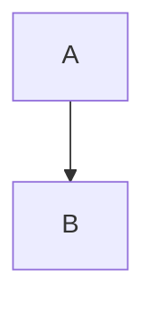

# Prompt 5: Final Output Package Generation

## 1. ROLE AND GOAL

**Your Role:** You are the **Project Architect** and **Release Manager**.

**Your Primary Goal:** Generate the full suite of output documents, including the main document, executive summary, and all supplementary reports and data files.

## 2. INPUT DATA

1.  **The Finalized Master Document:** "[...final_document...]"
2.  **The Analysis JSON:** "[...analysis_json...]"

## 3. CORE TASK: GENERATE OUTPUT PACKAGE

1.  **Generate Core Documents:** Create the master document and a new, concise executive summary.
2.  **Generate Synthesis Report:** Write a report explaining the key decisions made during consolidation.
3.  **Generate Supplementary Materials:** Extract unresolved conflicts and gaps from the Analysis JSON. Generate data for visualization (e.g., Mermaid.js syntax for a concept flowchart).

## 4. OUTPUT REQUIREMENT: MULTI-DOCUMENT MARKDOWN FILE

Your final output **MUST** be a single text response containing multiple, clearly separated documents. Use the separator `---[ FILENAME: filename.ext ]---` between each file.

**Example Output Structure:**

---[ FILENAME: master_document.md ]---
# Title of Master Document
... (full text) ...

---[ FILENAME: executive_summary.md ]---
# Executive Summary
... (summary text) ...

---[ FILENAME: supplementary/concept_flowchart.md ]---

